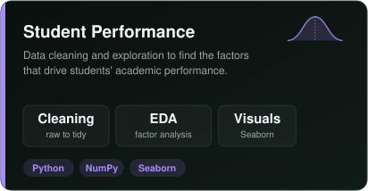

  

B.Tech student building **machine learning and data analysis projects end to end**, from raw data to a model or dashboard that answers a real question. 
Most of my work sits around **Indian markets and time-series data**. I care about results I can explain, not just a score.

 

<!-- Portfolio aur Email ke button: link bhar ke niche ki 2 lines uncomment karo

-->

  

## Selected work

## Toolbox

| Area | Tools |
|---|---|
| Languages | Python, SQL |
| ML / DL | Scikit-learn, PyTorch |
| Data | Pandas, NumPy, Matplotlib, Seaborn |
| BI | Power BI (DAX) |
| Interests | Quantitative finance, time-series forecasting, deep learning |
